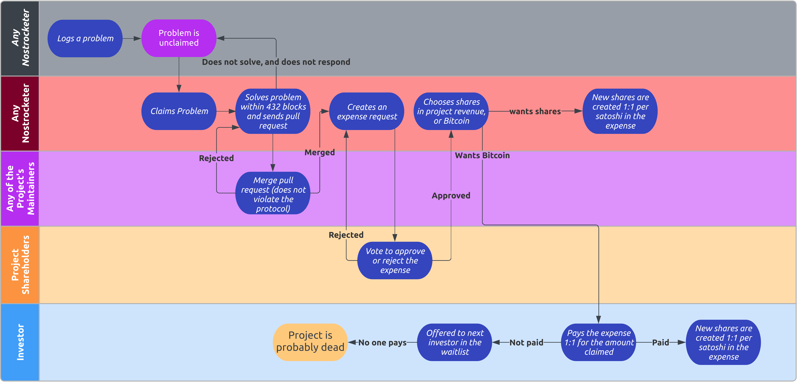

## Why Bitcoin?
There's no limit to the number of reasons why Nostrocket depends on Bitcoin, as anyone who's ever uttered *fix the money fix the world* will understand. Here are some examples:

* A free and open system requires honest price discovery, which can only happen with sound money.
* A community based on a Money that *can* be created at no cost is a community that ultimately becomes worthless.
* Nostrocket needs a source of undeniable and objective *Newtonian* truth that everyone can agree on:
    * A shared clock is required to know when things happened in the past, what's happening right now, and roughly how long till things should happen in the future.
    * Did some information exist at a certain point in time?
    * What is the current financial state of a system/organization/person/transaction/etc?
    * We cannot reason about the Nostrocket economy without a known constant of economics - Bitcoin gives us one: 21 million.
* Nostrocket requires transactions to work even when powerful actors want to censor them.
* If Nostrocket really blasts off, The Fiat Dominion will perceive it as a threat and try to kill it, so it has to be sufficiently robust. This means Nostrocket must somehow be rooted in Proof of Energy.
* Nostrocket requires some mechanism by which state can be considered *immutable* - optimising to execute and settle state as close as possible to the "bare metal" of Bitcoin allows immutability to be secured by raw energy.
* We need to know (in a way that leaves no doubt) when something doesn't work and let Nostrocket's *ideas* die instead of Nostrocket itself. Bitcoin is a source of *Darwinian* truth, and *can* act as guard rails against Darwinian mistakes - does a particular Subrocket produce surplus or not?

* * *

## How does Nostrocket work economically?
A Subrocket is kind of like a company.

Subrockets revolve around Shares. Each Subrocket has its own set of Shares. These represent work that has been done within the project.
* Shares are ONLY created by approving an expense.
* An Expense is ONLY created in response to work done, this can be a merged pull-request, or it could be things like paying for a VPS to host a relay, or time spent on devops or whatever.
* Shares are always produced 1:1 per satoshi claimed in the expense

There is a process to ensure that all Subrockets are solving real problems, and so projects are expected to produce revenue at some point.
* Nostrocket is noncustodial. Revenue goes straight to shareholders in proportion to how many shares they have and how long they have had them.

The only way to get shares in a Subrocket is to do work solving problems and claim an expense, or pay for someone's approved expense or buy their shares.

Contributors who are not interested in the future revenue of a project and only want to be paid in sats for every contribution they make should indicate this in their expense request.
* When their expense is approved, shares will not be credited to their account. Instead, the expense will be offered to investors (and sometimes this might be the project creator), who will be instructed to pay the expense amount to the contributor's LNURL or Bitcoin address. 
* When payment of the expense is detected, shares are created in the investor's account instead of the contributor.

Contributors can switch between shares and direct payment with every expense request.

[Further Reading](/protocol.html)

* * *

## How are expenses approved?

When a contributor submits an expense to a Subrocket, they also provide a link to the merged pull request or evidence of the work they have done in the case of non-code contributions.

The existing shareholders in the project can then vote to approve or reject the expense.

### The weighting of shares is dependent on the *Leadtime* for spending those particular shares.

`Voting Power = Shares * Leadtime`

All shares are created with `Leadtime` of `0`.

A Participant MAY *increase* OR *decrease* the Leadtime on their shares by exactly `1` unit every 2,016 blocks (but leadtime can't become negative)

Shares *cannot* be spent/transferred/sold if their `Leadtime > 0`.

### An expense is approved if:
* more than 70% of the project's total Votepower approves
* more than 42% of the project's total Votepower approves, and less than 5% reject, after waiting 288 blocks
* more than 8% of the project's total Votepower approves, and less than 1% reject, after waiting 1008 blocks

Participants SHOULD vote to reject an expense unless it's along the direct route (or *critical path*) to more users or revenue for the project.
